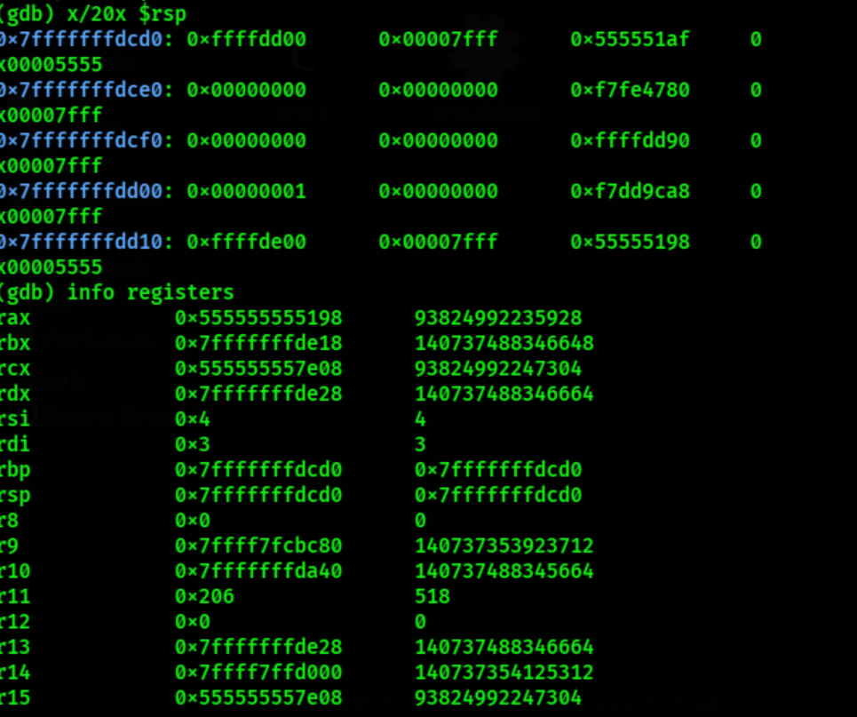
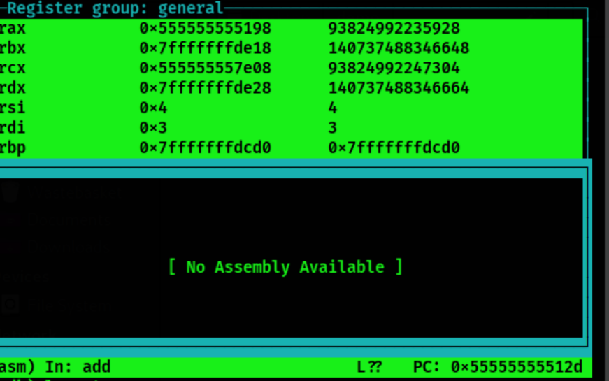

# C → Assembly → Stack Frames: A Complete Practical Understanding

## Introduction — Why Assembly Understanding Matters

If you want to master reverse engineering, exploitation, or low-level systems work, we must understand:

- how C compiles down to assembly  
- how functions set up and tear down stack frames  
- how calling conventions move arguments and return values  
- how compiler optimizations change the frame layout  

This post walks through small, reproducible examples and shows how to verify assumptions with **Ghidra** and **gdb**.

---

# Test Functions

Save the following as `test.c` or inside a `code/` folder.

```c
#include <stdio.h>

int add(int a, int b) {
    int c = a + b;
    return c;
}

int sum_array(int *arr, int n) {
    int s = 0;
    for (int i = 0; i < n; i++) {
        s += arr[i];
    }
    return s;
}

int test_local_array() {
    int arr[4];
    arr[0] = 5;
    return arr[0];
}

int main() {
    int x = add(3, 4);
    int y = test_local_array();
    int z = sum_array((int[]){1,2,3}, 3);
    return x + y + z;
}


```

-----------

# Compile With Different Flags

To observe different stack-frame behaviors:
```bash
gcc -O0 -fno-omit-frame-pointer test.c -o test_O0
gcc -O2 test.c -o test_O2

```
**What these flags mean:**

- `-O0` → preserves a clean, RBP-based frame
    
- `-O2` → may inline functions and optimize away locals
    
- `-fno-omit-frame-pointer` → forces usage of **RBP** even with optimizations
    

---

# Assembly Breakdown: Prologue & Epilogue

### Typical x86_64 prologue (with frame pointer):

```asm
push rbp
mov  rbp, rsp
sub  rsp, 0x10    ; allocate locals

```
### Typical epilogue:

```asm
leave            ; mov rsp, rbp ; pop rbp
ret

```
---

# Calling Convention (System V AMD64)

Registers for arguments:

1. **rdi**
    
2. **rsi**
    
3. **rdx**
    
4. **rcx**
    
5. **r8**
    
6. **r9**
    

Return value always in:

- **rax**
    

---

# Stack Frame (ASCII Diagram)

### Before function call

```css
High addresses
+----------------------+
| Caller data ...      |
+----------------------+
| Return Address (call)|
+----------------------+
Low addresses

```
### Inside callee (after prologue)

```css
High addresses
+----------------------+
| Saved RBP (push rbp) |
+----------------------+
| Return Address       |
+----------------------+
| Local variables      |
+----------------------+
| Padding / alignment  |
+----------------------+
Low addresses

```

Image reference example:



---

# RBP / RSP Tracking (Why It Matters)

Key facts:

- `rbp` becomes a **stable reference point**
    
- `rsp` moves when allocating locals
    
- locals live at:  
    **[rbp - offset]**
    
- saved return address always at:  
    **[rbp + 8]**
    

For exploitation, you must know where the **saved RIP** is relative to user-controlled data.

---

# Cross Verification: Ghidra & gdb

## Ghidra — Verify:

- decompiler view
    
- stack frame window
    
- local variable offsets
    
- prologue & epilogue in disassembly
    

## gdb — Recommended commands:

```gdb
disassemble add
break add
run
layout asm
info frame
p $rbp
p $rsp
x/16x $rsp

```
Example image placeholders:

```bash
images/prologue.png
images/gdb-layout.png
images/ghidra-decompile.png

```

---

# Mini Examples

## 1) Simple arithmetic

```c
int square(int x) { return x * x; }
```
Shows register-only computation—no stack usage.

---

## 2) Loop (sum_array)

Demonstrates:

- local loop index stored on stack
    
- array indexing: `[rdi + rax*4]`
    
- loop control logic
    

---

## 3) Local arrays

```c
int test() {
    int arr[4];
    arr[0] = 5;
    return arr[0];
}
```

Compiler usually allocates:

```asm
sub rsp, 0x20
```

due to alignment requirements.

---

# Recommended Images (place inside `images/`)

- stack-before-call.png
    
- prologue.png
    
- gdb-layout.png
    
- ghidra-decompile.png
    

Example usage:

```css

```
---

# Conclusion — Why This Matters for Exploitation

By understanding real stack frames, you gain the ability to:

- locate overflow boundaries
    
- find saved RIP
    
- track RBP usage
    
- reverse-engineer compiler decisions
    
- reason about PIE/ASLR
    
- calculate exact ROP offsets
    

This knowledge is the foundation for:

- ret2libc
    
- stack canary bypass
    
- full exploit development
    
- reliable reverse engineering